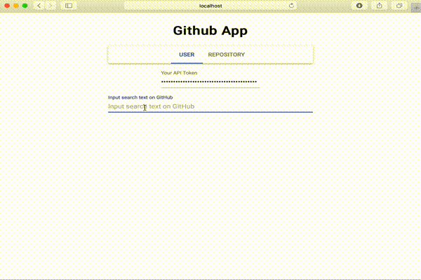

# React Example - GitHub Searcher

## Overview
It's build on top of [create-react-app]

(https://github.com/facebook/create-react-app).

## Demo
[Link](https://githubsearcher-4a790.firebaseapp.com/)

## Technology
* React
* GitHub GraphQL API
* Bulma CSS

## Local Development
Run `yarn` and `yarn start`.

## How to get GitHub Token
* Settings -> Developer Settings -> Personal access tokens -> Generate new token
* Check `repo` and `user`
  * Current version doesn't provide the repository search function. It'll be coming soom.
* Generate token

## TODO
* [x] Search repositories
* [ ] Show details about user/repository
* [ ] Add tests
* [ ] Redux

## License
The MIT License (MIT). Please see License File for more information.
